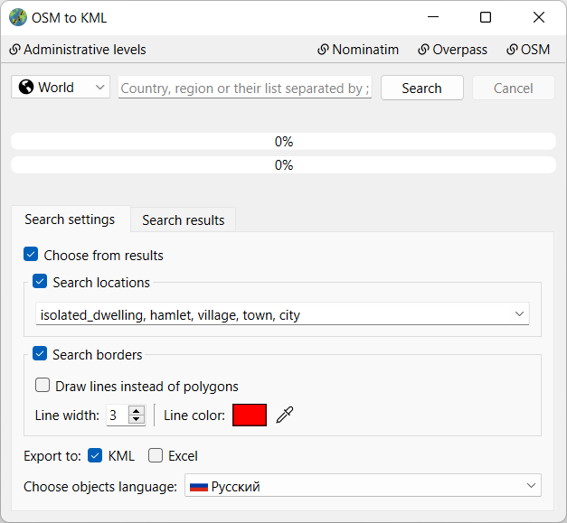
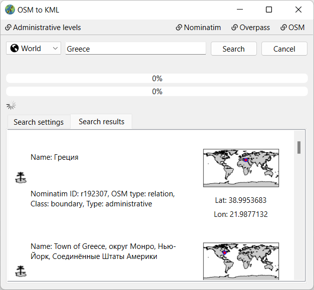

<h1> Earth Crawler</h1>

  

An app for accuairing data, sech as locations coordinates or region borders, from OSM map.

## Usage
1. Run  earth_crawler_gui.py or compiled Earth Crawler.exe from <i>Releases</i> section.
2. Choose a search mode (World, Country or State).
3. Type region name you want to search. Region administrative level can be specified too. Format: `region_name=admin_level`, where `admin_level` has to be between 3 and 10. In order to load multiple objects at once, use `;` as separator.
4. Configure search settings if needed.
5. Click <b>Search</b> button or press <b>Enter</b>.
6. If the <b>Choose from results</b> option was chosen - switch to <b>Search results</b> tab and select one from list. Then repeat stage 5.

## Screenshots

